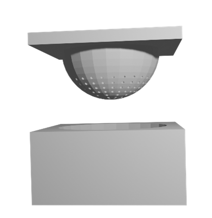

# RoboSkin
This is a library for interfacing with optical tactile skin sensors for robotics projects.

Sensing an environment is seen within many adaptive agents, and much of this within biology is tactile. High resolution tactile sensing allows environmental sensing over larger surface areas as well as more detailed information about the surfaces. This library has the support for reading interpreting tactile information.

## Constructing the sensor

### Tactip
The <a href="https://softroboticstoolkit.com/tactip">TacTip</a>, developed from BRL, parts were 3D printed and consisted of a camera mount, main body, tip and ring. The camera mount was edited on CAD software to mount our webcam (a cheap standard Logitech USB webcam), the main body would attach on to the mound via a series of screws.

The camera was mounted onto a custom 3D printed part that connected to a repurposed USB wide angle lens webcam. The webcam had the circular vision in the centre, which would need cropping at a later stage. The power of the LED ring was connected to the power of the USB camera.  

The skins produced through silicone within a <a href="">3D printed plastic mould</a>. This mould was measured to fit the silicone inside a thin layer, with small holes in to create the tips that would later be painted white.

Silicone was made and dyed black to prevent light interference. After being poured into the mould and left for twenty-four hours, a solid yet flexible tactip was produced. The The mould required a lubricant spray over to prevent the tips getting pulled off. To paint the tips we used a thin layer of plastic sheet with an acrylic paint. The tip was turned inside out (so the tips were on the exterioir) and gently dabbed over the paint.  

After drying we poured a clear silicone gel into the tactip and left to set in a vacuum chamber for an hour, and then left in an oven at 80 degrees centigrade for 2.5 hours to cure. This gave the tip some force against a surface so it would not cave in under force.  

### General skin

### parts list
You will need access to 3D printing, an oven and laser cutting. 

## Using the library
